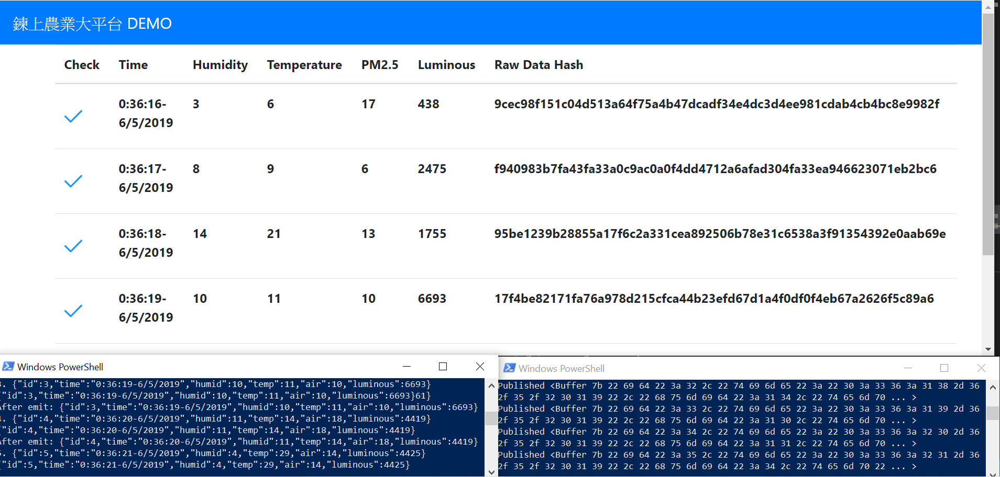
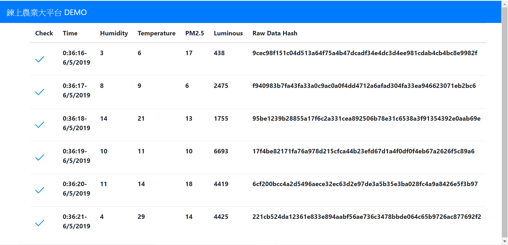

# Real time Update IOT data with MQTT and Node.js

MQTT client generate JSON data and publish to MQTT network.
MQTT Broker Generate Data and Send to Node Server. Then, WEB update the Data Dynamicaly with Socket.IO and Store the Hash Value of Raw Data on Local Ethereum Blockchain

